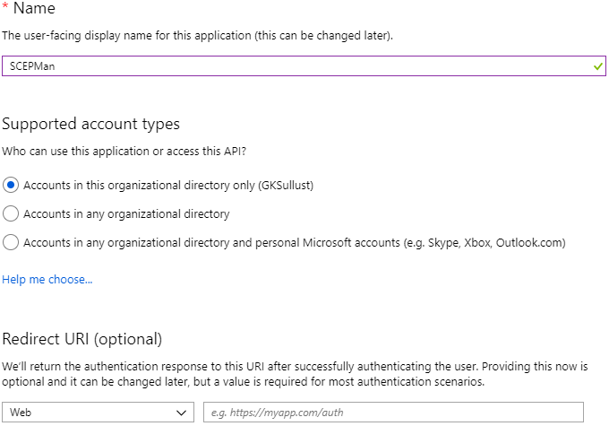
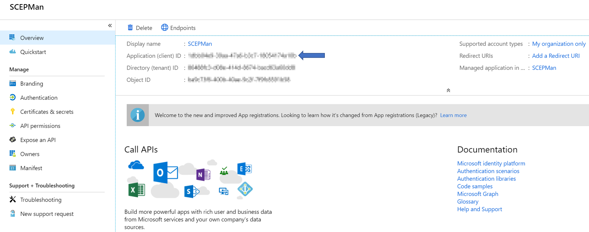
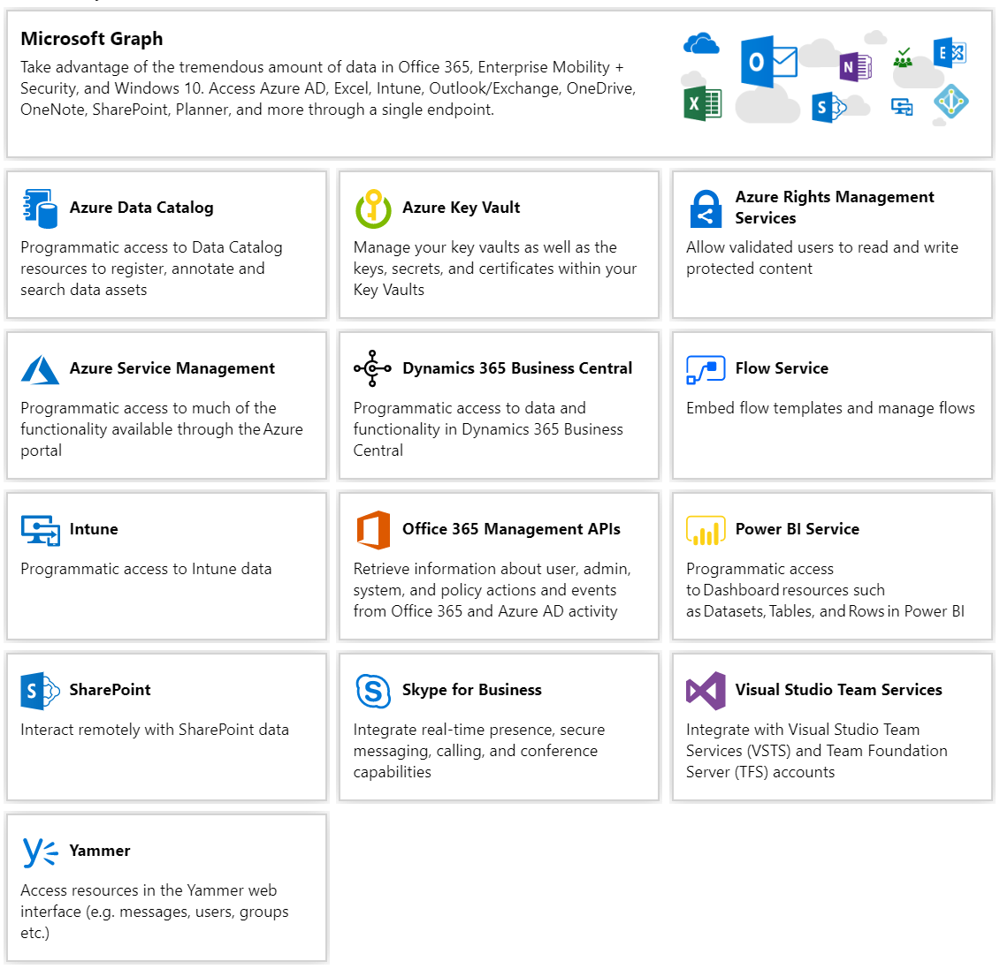

# SCEPMan
## Abstract
SCEPman implements an unattended Certificate Authority for Microsoft Intune based certificate deployment described in [this](https://docs.microsoft.com/en-us/mem/intune/protect/scep-libraries-apis) document:

“In Microsoft Intune, you can add third-party certificate authorities (CA), and have these CAs issue and validate certificates using the Simple Certificate Enrollment Protocol (SCEP). [Add third-party certification authority](https://docs.microsoft.com/en-us/mem/intune/protect/certificate-authority-add-scep-overview) provides an overview of this feature, and describes the Administrator tasks in Intune.”

The implementation is a .net core C# based Azure WebApp providing the [SCEP](https://datatracker.ietf.org/doc/html/rfc8894) and Intune API, using [Bouncy Castle](https://www.bouncycastle.org/) to implement the necessary certificate request handling and [Azure Key Vault](https://docs.microsoft.com/en-us/rest/api/keyvault/) based RootCA and certificate signing. No other component needs to be involved, neither a database nor any other stateful storage except the Key Vault. That said, the concept will not need any backup procedures.
  
Please see https://docs.scepman.com/ for full documentation.
  
## Deployment
### Register an application in Azure Active Directory

#### Add a new app registration in Azure Active Directory
1. Login to your [Azure Portal](http://portal.azure.com/) with an Admin Account.
2. Navigate to **Azure Active Directory**
3. Choose **App registrations**
4. Click **New registration**
5. Set supported account types to **Accounts in this organizational directory only**

6. Save the **Application (client) ID** somewhere because you will need it for the deployment

#### Create a client secret
1. Select the **Certificates & secrets** blade
2. Add a new client secret with **New client secret**
3. Define a Description and set expiration to **Never**
4. Save the generated secret somewhere because you are not able to look it up again

#### Set API permissions
1. Select the **API permissions** blade
2. Click **Add a permission** to grant required permissions

3. Select **Intune** 
4. Choose **Application permissions** as the permission type
5. Click **scep_challenge_provider** and confirm with **Add permission**
6. Click **Add a permission** once again
7. Select **Microsoft Graph**
8. Choose **Application permissions** as the permission type again
9. Expand **Directory** and check **Directory.Read.All** and confirm with **Add permission**
10. Click **Grant admin consent** and confirm the displayed dialog with **Yes**

Your API permissions should be configured like this:

### Deploy to Azure

When the app registration is done use this button to deploy SCEPMan to your Azure subscription.

Instead, you can also Deploy the Beta or Internal Channels of SCEPman 2.0 as described in [the official SCEPman documentation](https://docs.scepman.com/scepman-deployment/deployment-options/scepman-2.x-deployment).

When clicking the deploy button you will see this form dialog

1. Select an existing resource group or create a new one. The SCEPMan resources will be deployed in this resource group.
2. Set the location according to your location
3. Insert the GUID of the app registriation which you have created in the steps before
4. Insert the client secret of this app registration
5. Define a name for key vault, app service plan and web site
6. Agree to the terms and conditions by clicking the checkbox
7. Click **Purchase**

Sometimes it is necessary to restart the app service before SCEPMan runs properly.

### Create root certificate

* Follow instructions on the homepage of your SCEPman installation.
