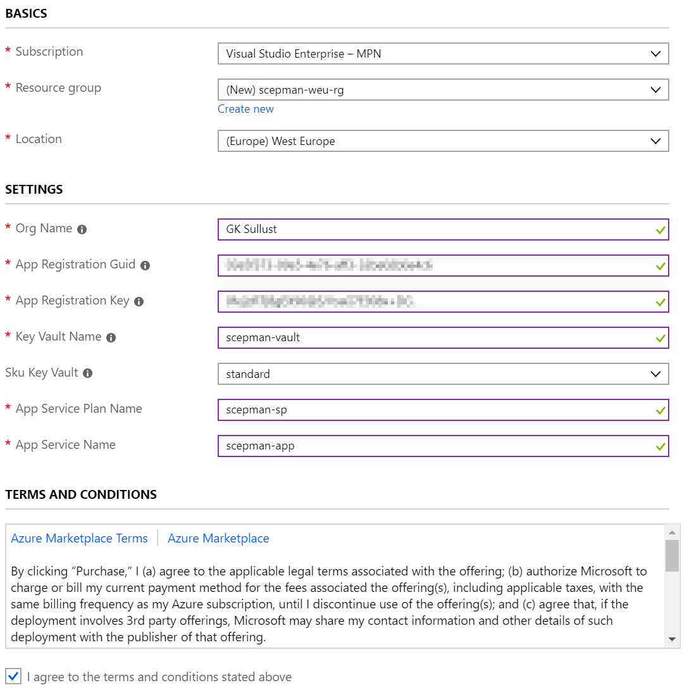

# SCEPman 2.x Deployment

The deployment of SCEPman 2.x is different to a SCEPman 1.x deployment. If you install a new SCEPman 2.x instance, you should follow the steps in this article. If you install a new SCEPman 1.x instance, you should follow the original guide.

If you want to upgrade from SCEPman 1.x to SCEPman 2.x, you can just auto-update (using a [channel with SCEPman 2.x](https://docs.scepman.com/scepman-configuration/optional/application-artifacts)). In order to use all new features, you need to perform some extra steps outlined later in this article.

## New SCEPman 2.0 Instance

### Deploy Azure Resources

Log in with an AAD Administrator account and visit this site. Click on a deployment link:

- Production channel is still on SCEPman 1.x
- <a href="https://portal.azure.com/#create/Microsoft.Template/uri/https%3A%2F%2Fraw.githubusercontent.com%2Fscepman%2Finstall%2Fmaster%2Fazuredeploy-beta.json" target="_blank">Beta Channel</a>
- <a href="https://portal.azure.com/#create/Microsoft.Template/uri/https%3A%2F%2Fraw.githubusercontent.com%2Fscepman%2Finstall%2Fmaster%2Fazuredeploy-internal.json" target="_blank">Internal Channel</a>

Fill out the values in the form, similar to this screenshot:

1. Select an existing resource group or create a new one. The SCEPMan resources will be deployed in this resource group.
2. Set the location according to your location
3. Define a name for key vault, app service plan, storage account, and for the two web sites. The two web sites are the SCEPman App Service and the CertMaster App Service. You will need the name of the SCEPman App Service later on.
4. Agree to the terms and conditions by clicking the checkbox
5. Click **Purchase**

### Configure App Registrations

Prerequistes:
- A Global Admin Account for the tenant to which you want to install SCEPman
- A workstation with [az CLI](https://docs.microsoft.com/en-us/cli/azure/install-azure-cli) installed (Alternatively: Azure Cloud Shell)

1. Download the <a href="https://portal.azure.com/#create/Microsoft.Template/uri/https%3A%2F%2Fraw.githubusercontent.com%2Fscepman%2Finstall%2Fmaster%2Fregister-certmaster.ps1" target="_blank">SCEPman configuration PowerShell Script</a>.
2. Execute the script. We recommend setting `$InformationPreference = "Continue"` to get more feedback about what's happening.
3. You will be asked for the name of SCEPman app service.
4. Log on with a Global Admin account when asked to.

### Create Root Certificate

* Follow instructions on the homepage of your SCEPman installation.

### Granting the Rights to Request Certificates via the CertMaster Website

Create an AAD Group, possibly a Priviledged Access Group, for the people that shall be able to create web server certificates via CertMaster.

In the Azure Portal, visit [Enterprise applications](https://portal.azure.com/#blade/Microsoft_AAD_IAM/StartboardApplicationsMenuBlade/AllApps/menuId/). Select "All Applications" as Application type, search for *SCEPman-CertMaster*, and select the displayed application. Navigate to *Users and groups* and click *Add user/group* on the top menu. Select the group you have previously created. The role will automatically be chosen as *Full Admin*. After you hit *Assign*, direct members of the group can visit the CertMaster website and request certificates. Note that using CertMaster is an Enterprise feature. After assignment, the setting should look like this:

## Upgrade From 1.x To 2.x

To be described ...